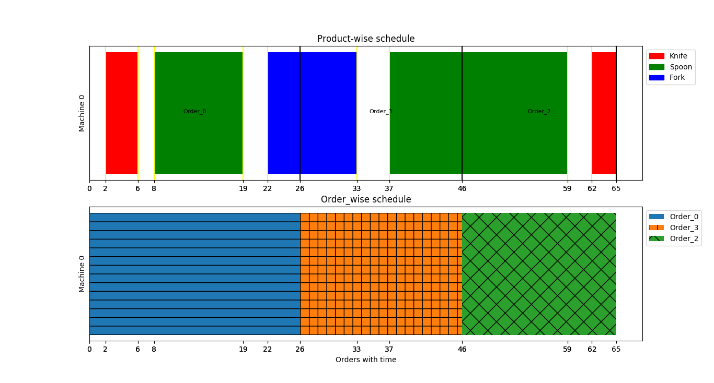

## Running Project ##
```
python processOrder.py ./data/order.txt
```
This will load data from `order.txt` into program

## Feeding Data
There are two files inside data folder:
1. `order.txt`  
This file contains order data.
2. `products.txt`  
This file is equivalen to `enum` type. It lists different produt types.
## Change Planning Duration ##
By default, system takes maximum value of `deadline` from orders. You can set inside `solve()` method.

## Output ##


